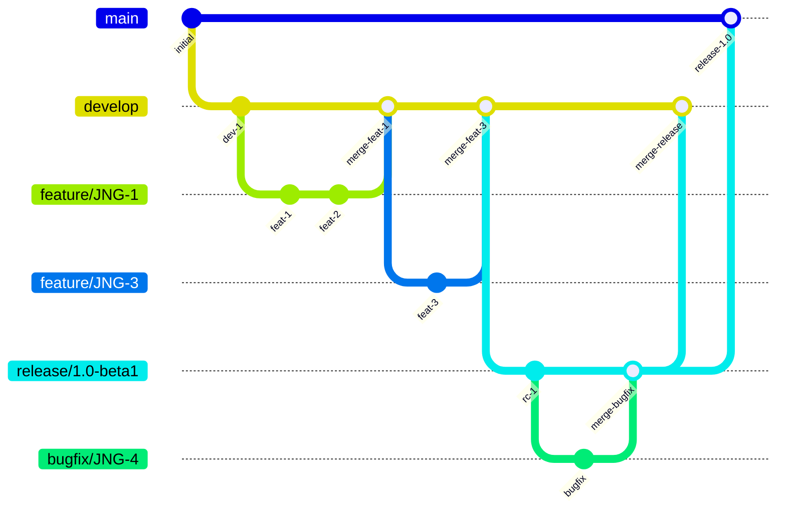
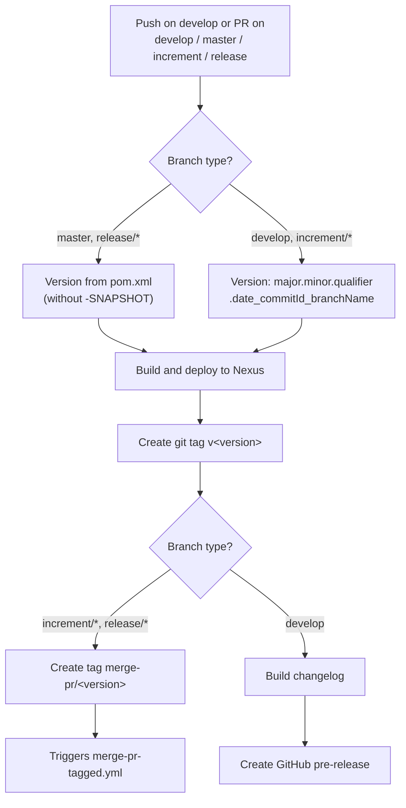
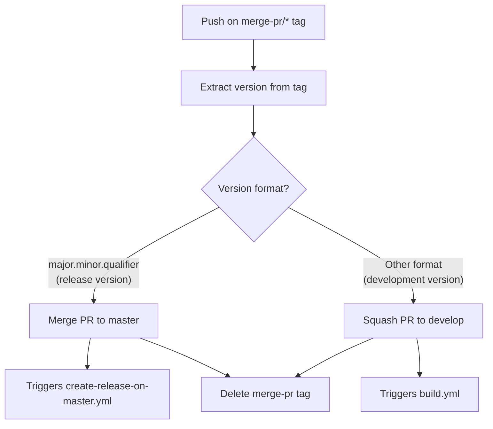
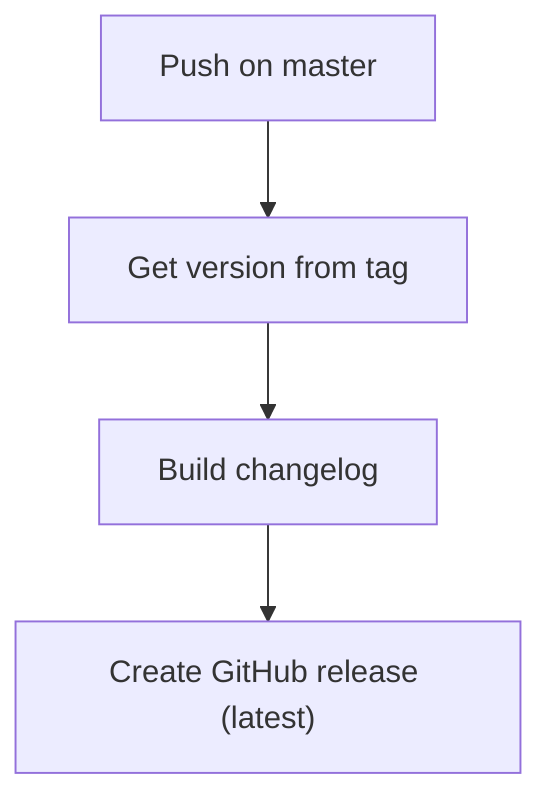
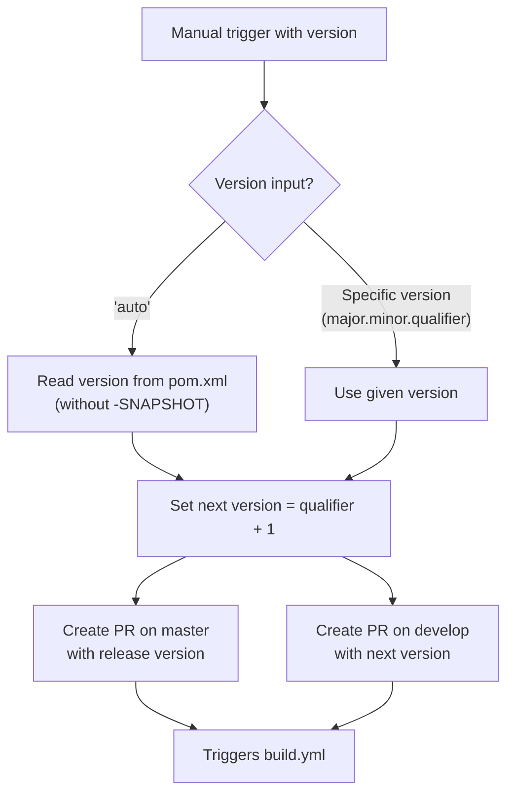

# Development Version and Branch Handling

This document describes the branching strategy, versioning policy, and CI/CD pipeline for the OSGi AsciiDoc Converter project. The workflow is based on GitFlow and automated through GitHub Actions.

## Branches

The branching model follows [GitFlow](https://www.atlassian.com/git/tutorials/comparing-workflows/gitflow-workflow). Each branch type serves a specific purpose in the development lifecycle:

| Branch Pattern | Purpose | Based On |
|----------------|---------|----------|
| `develop` | Latest development sources of the active version | — |
| `feature/JNG-NUMBER_summary` | New features for the active version | `develop` |
| `(release/)X.Y.Z` | Release stabilization (`release/` prefix reserved for CI) | `develop` |
| `bugfix/JNG-NUMBER_summary` | Bug fixes during release testing | release branch |
| `support/JNG-NUMBER_summary` | Minor changes to a previous release | release branch |
| `master` | Latest released sources | release branch merge |
| `hotfix/JNG-NUMBER_summary` | Critical production fixes | `master` |

> **Important:** Bugfix and support branches must be applied to **both** the originating release branch and all newer release/development branches.

## Version Numbers

Versions follow semantic versioning. The rules for when to increment each part depend on the branch type:

| Branch Type | Version Action |
|-------------|---------------|
| `feature/*` | Do **not** change version numbers |
| `develop` | Increment 2nd number when a release branch is created |
| `bugfix/*` | Do **not** change version numbers (applied to release branches pre-merge to master) |
| `support/*` | Increment 3rd number when started (for minor changes to previous releases) |
| `hotfix/*` | Increment 4th number when started (applied to both release and master branches) |

## GitHub Actions Workflows

The CI/CD system uses four interconnected GitHub Actions workflows. Each workflow triggers automatically based on branch and tag events.

### build.yml — Main Build Pipeline

This workflow runs on every push to `develop` and on pull requests targeting `develop`, `master`, `increment/*`, or `release/*` branches.

### merge-pr-tagged.yml — PR Auto-Merge

Triggered when a `merge-pr/*` tag is pushed. Routes the PR to the correct target branch based on version format.

### create-release-on-master.yml — Release Finalization

Triggered on every push to `master`. Creates the final GitHub release with a generated changelog.

### release.yml — Manual Release Trigger

Manually triggered with a version parameter. Creates pull requests for both the release and the next development version.

## How to Develop

Issue tracking uses [JIRA](https://blackbelt.atlassian.net/jira/dashboards).

> **Important:** There is no commit without a ticket number. Every pull request and commit must include a `JNG-xxx` reference.
