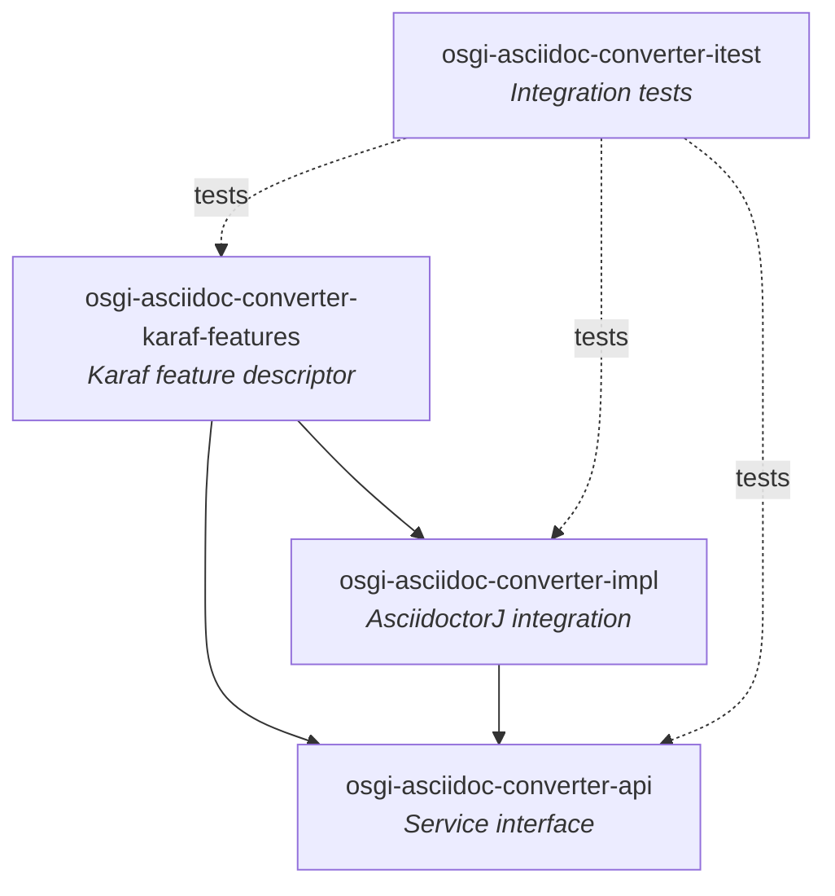

# Contributing to OSGi AsciiDoc Converter

This guide covers how to set up your development environment, build the project, and submit changes to the OSGi AsciiDoc Converter project.

## Development Environment

Before you start, make sure your environment meets these requirements:

| Requirement | Version |
|-------------|---------|
| Java JDK | 21 |
| Maven | 3.9.4+ (wrapper included via `mvnw`) |

For additional environment setup details (IDE, OS-specific configurations), refer to the parent project's [CONTRIBUTING guide](https://github.com/BlackBeltTechnology/judo-community/blob/develop/CONTRIBUTING.adoc).

## Project Structure

This is a multi-module Maven project that wraps [AsciidoctorJ](https://github.com/asciidoctor/asciidoctorj) as an OSGi service for Apache Karaf. The modules are organized in layers:



## Build Commands

```bash
# Full build (all modules + tests)
mvn clean install

# Quick build without integration tests
mvn clean install -pl !osgi-asciidoc-converter-itest

# Run unit tests only
mvn clean test

# Skip all tests
mvn clean install -DskipTests
```

> **Note:** The Maven wrapper (`./mvnw`) is available if you don't have Maven installed globally.

## Submitting an Issue

Before filing a new issue, search the [issue tracker](https://github.com/BlackBeltTechnology/osgi-asciidoc-converter/issues) first — your problem may already be reported or resolved.

When reporting a bug, include a minimal reproducible scenario. This helps maintainers diagnose the problem quickly without back-and-forth. At minimum, provide:

- Output of `java -version` and `mvn -version`
- Relevant `pom.xml` or `.flattened-pom.xml` content
- A use-case that demonstrates the failure

File new issues using the [issue form](https://github.com/BlackBeltTechnology/osgi-asciidoc-converter/issues/new/choose).

## Submitting a Pull Request

This project follows [GitHub's standard forking model](https://guides.github.com/activities/forking/). Fork the repository and submit pull requests from your fork.
